# Project 2 – AWS Deployment of Flask Web Application

## Summary

This project demonstrates the complete deployment of a full-stack web application on AWS EC2 using Ubuntu 24.04 LTS. The application integrates Flask, SQLite3, Apache2, and mod_wsgi to create a secure, production-style web environment. It supports user registration, authentication with session protection, file upload processing, and dynamic word count computation. The project showcases practical cloud deployment, server configuration, backend development, and secure session-based access control.

---

## Overview

This project demonstrates deploying a full-stack web application on AWS EC2 (Ubuntu 24.04 LTS) using:

- Apache2
- mod_wsgi
- Python 3
- Flask
- SQLite3
- Bootstrap 5 (for UI styling)

The application supports:

- User Registration
- Secure Login with Session Management
- Profile Display
- File Upload (Limerick.txt)
- Word Count Calculation
- File Download
- Session-Protected Routes

---

# Live Deployment

Application URL:

http://18.220.233.163/

---

# AWS Setup

## AWS Console

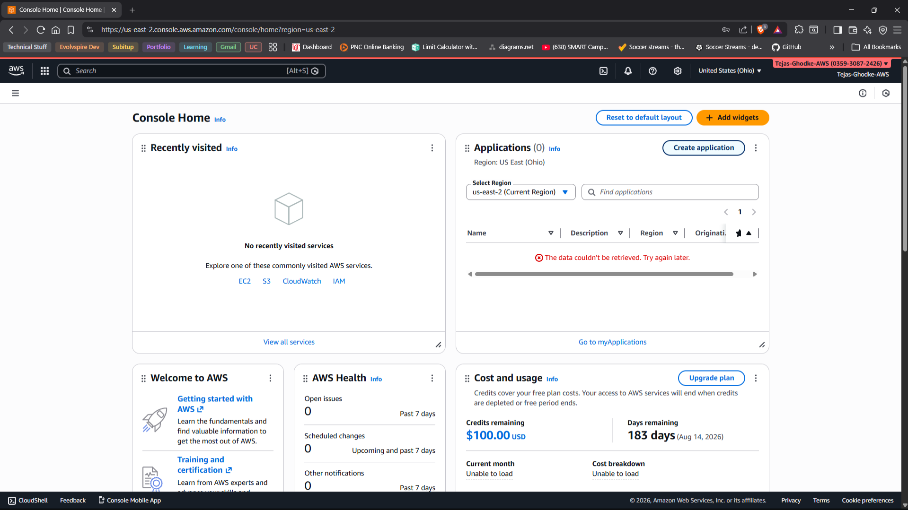

## Launch EC2 Instance

Ubuntu Server 24.04 LTS (Free Tier Eligible)

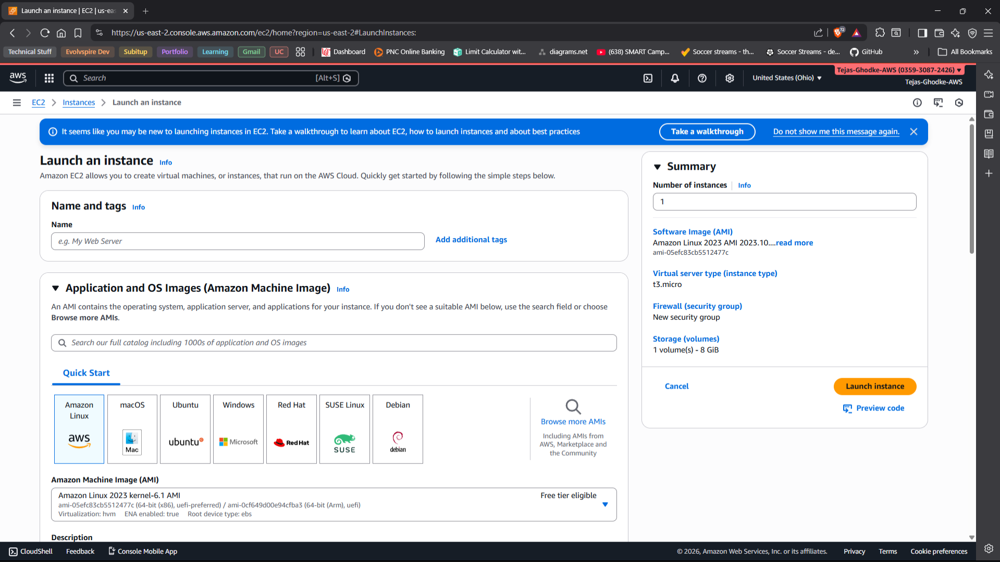

## EC2 Dashboard

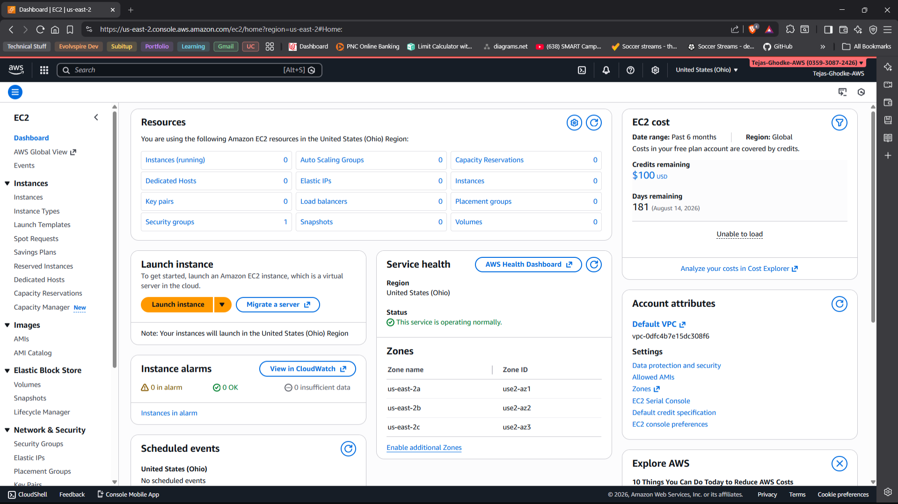

## Running Instance

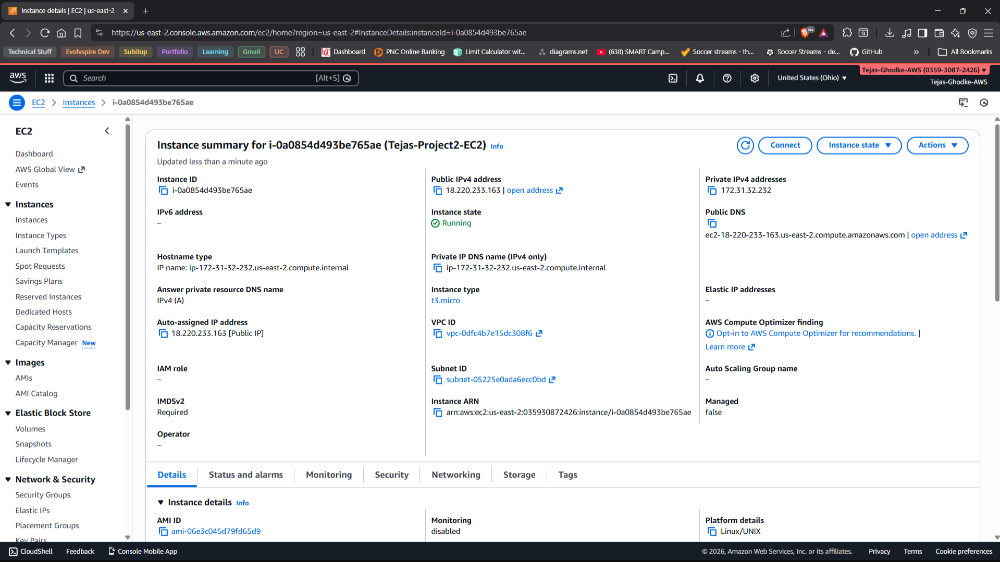

---

# Server Configuration

## Connected to EC2 via SSH


## Apache2 Default Page

After installing Apache2, the default page confirms successful installation.

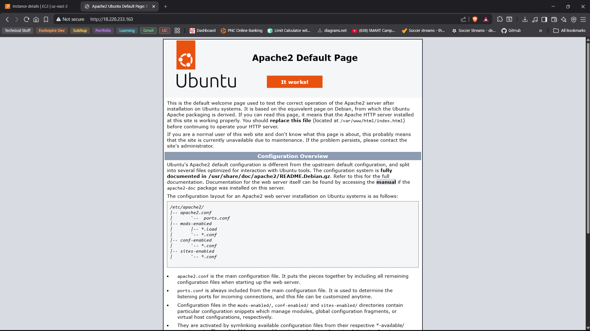

## Flask Running on Port 80 via Apache + mod_wsgi

The application is served through Apache instead of Flask's development server, simulating a production-style deployment.

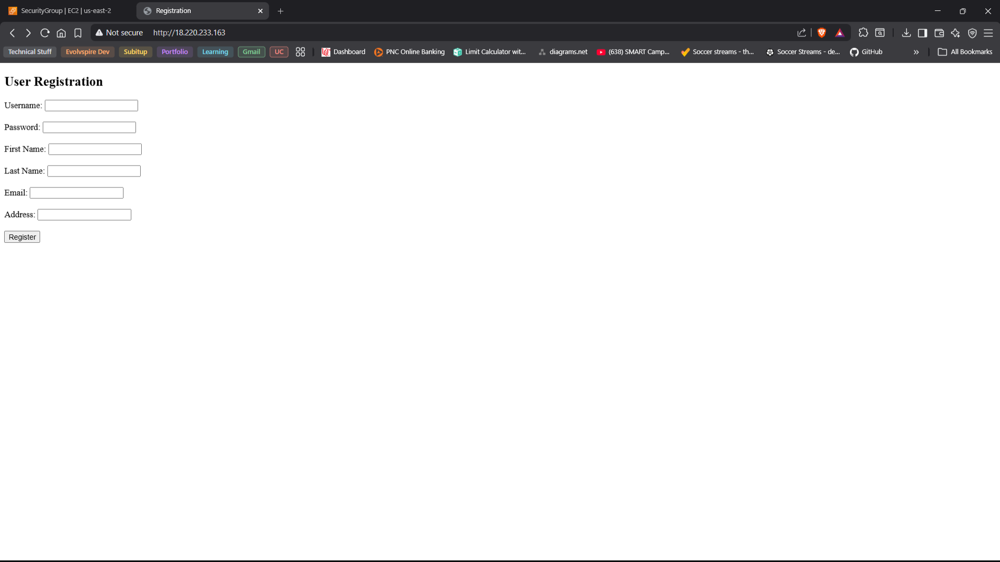

---

# Application Features

> **Note on screenshots:** The application screenshots below were captured before Bootstrap was applied. Functionality was tested first, and the UI was then beautified with Bootstrap 5.

## 1. Registration Page


Features:
- Username
- Password
- First Name
- Last Name
- Email
- Address
- Data stored in SQLite database

---

## 2. Login Page

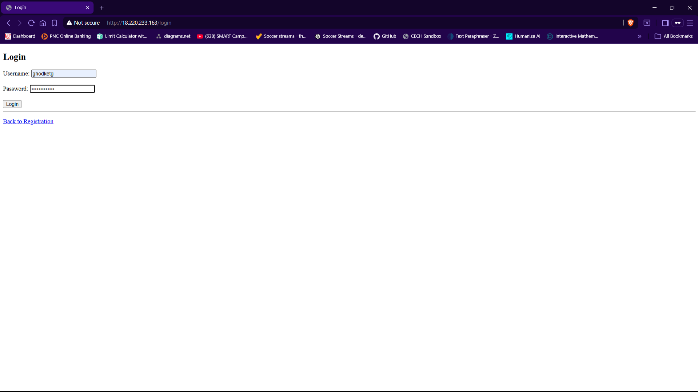

Secure login retrieves user profile using stored credentials.

---

## 3. Failed Login Handling

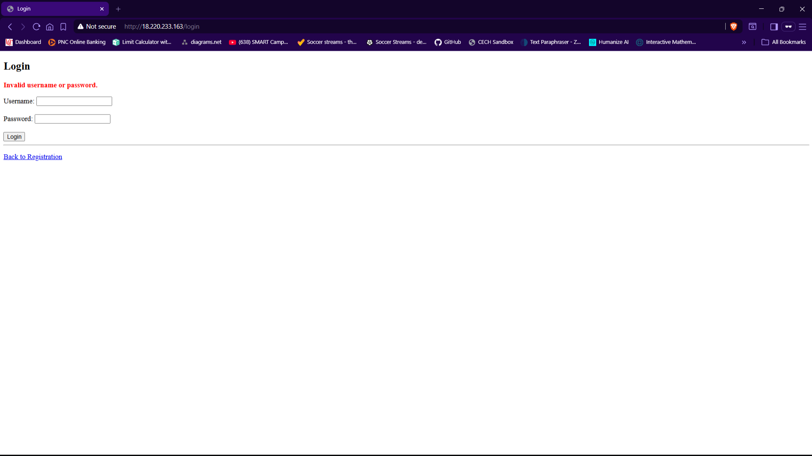

Displays Bootstrap-styled error message for invalid credentials.

---

## 4. Profile Page

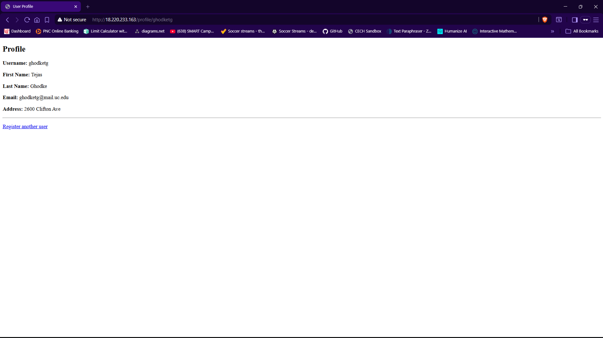

Displays stored user information:
- Username
- First Name
- Last Name
- Email
- Address

---

## 5. Upload Limerick.txt

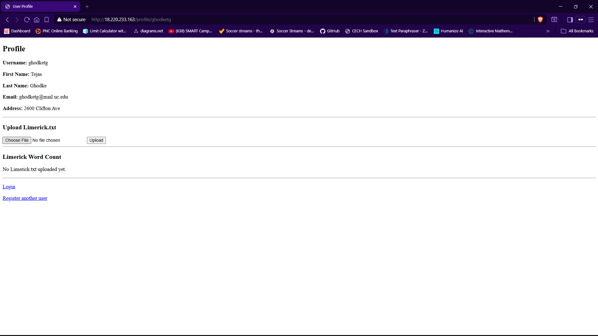

Allows user to:
- Upload Limerick.txt
- Store file on server
- Compute word count

---

## 6. Word Count Display

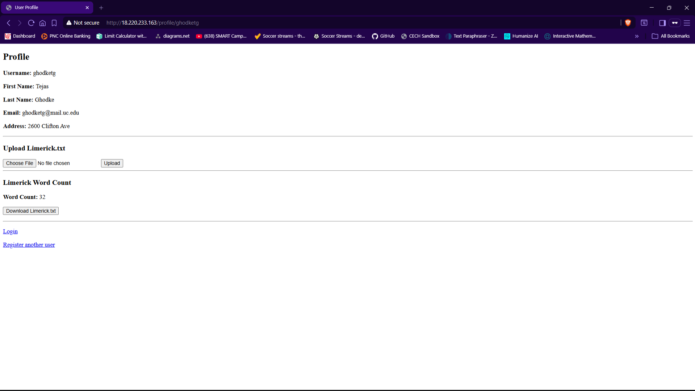

Displays calculated word count dynamically after upload.

---

## 7. Successful Login

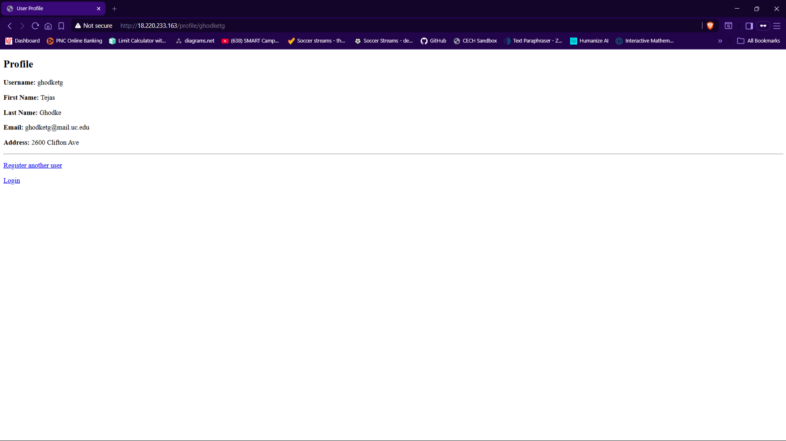

---

# Security Features

- Session-based authentication
- Direct access to /profile/<username> redirects to /login
- Upload and download routes protected by session validation
- SQLite write permissions configured properly
- Apache serving through mod_wsgi (development server not exposed)
- Port 5000 closed after deployment (only port 80 exposed)

---

# Technologies Used

- AWS EC2 (us-east-2)
- Ubuntu Server 24.04 LTS
- Apache2
- libapache2-mod-wsgi-py3
- Python 3.12
- Flask
- SQLite3
- Bootstrap 5

---

# Project File Structure

```
flaskapp/
├── app.py
├── flaskapp.wsgi
├── users.db
├── uploads/
└── templates/
    ├── register.html
    ├── login.html
    └── profile.html
```

---

# Server Setup Summary

```bash
sudo apt update
sudo apt install apache2
sudo apt install libapache2-mod-wsgi-py3
sudo apt install python3-pip
sudo apt install sqlite3
sudo systemctl restart apache2
```

---

# Conclusion

This project successfully demonstrates:

- Cloud deployment using AWS EC2
- Apache web server configuration
- Flask application integration with mod_wsgi
- SQLite database integration
- Secure session-based authentication
- File upload and processing
- Bootstrap-based user interface enhancement

The application is fully deployed and accessible via the public AWS EC2 URL listed above.
